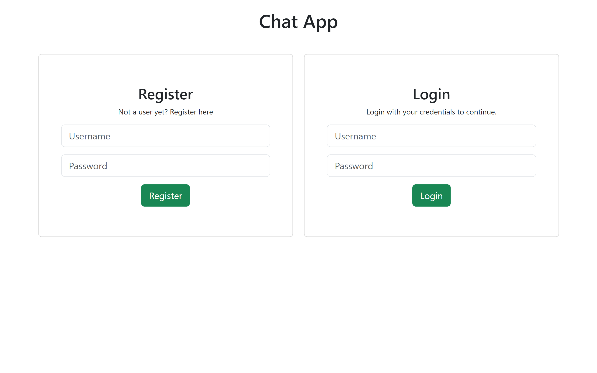
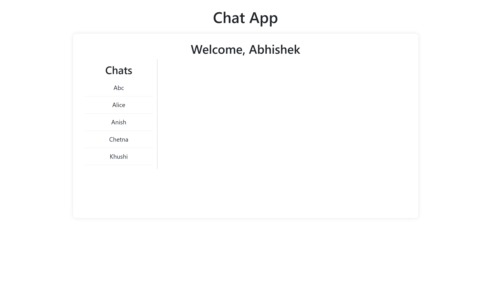
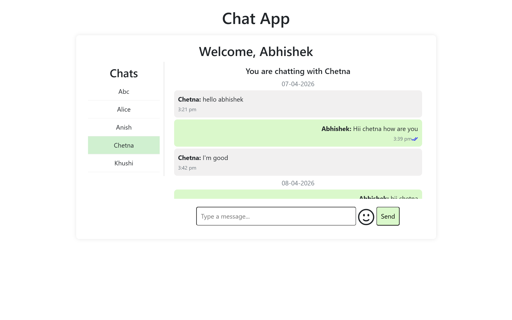
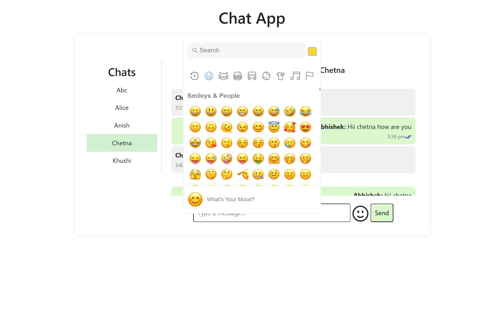

# Chat App

A full-stack real-time messaging application featuring secure authentication, instant messaging, online status, typing indicators, read receipts, and emoji support.<br>
Built with a React frontend, Express/Node backend, Socket.IO, and MongoDB.

---

## Tech Stack

**Frontend**
- React.js
- React Router DOM
- JavaScript (ES6+)
- React Icons
- Axios
- HTML5 & CSS3

**Backend**
- Node.js
- Express.js
- Socket.IO
- JWT Authentication
- RESTful APIs

**Database**
- MongoDB

---

## Live Demo

[Live Application](https://chat-app-frontend-iota-sand.vercel.app)<br><br>

[Project Walkthrough](https://drive.google.com/file/d/1zhux7Z3wSUgMca9IXi8-9GYADi2b-Om8/view?usp=sharing)<br><br>

[Backend Repository](https://github.com/Abhishek-Das251002/chat-app-backend)

---

## Screenshots

### Login



### Home



### Chat Interface



### Emoji Picker



---

## Features

**Authentication**

- Secure user authentication using JWT
- Protected application routes

**Real-Time Messaging**

- Send and receive messages instantly
- Real-time communication powered by Socket.IO

**Chat Experience**

- View online user status
- Typing indicators for active conversations
- Read receipts for delivered messages
- Emoji support for expressive conversations

---

## Quick Start

```bash
git clone https://github.com/Abhishek-Das251002/chat-app-frontend.git

cd chat-app-frontend

npm install

npm run dev
```

---

## Environment Setup

Create a `.env` file in the backend root directory and add the following environment variables:

```env
PORT=3000

MONGODB_URI=your_mongodb_atlas_connection_string

JWT_SECRET=your_jwt_secret
```

---

## Deployment

| Service | Platform |
|---------|----------|
| Frontend | Vercel |
| Backend | Render |
| Database | MongoDB Atlas |

---

## API References

### **POST /auth/login**

Authenticate a user.

### **POST /auth/register**

Register a new user.

### **GET /messages**

Retrieve conversation messages.

### **GET /users**

Retrieve available users.

---

> **Note:** Detailed API request and response payloads are available in the [backend repository](https://github.com/Abhishek-Das251002/chat-app-backend).

---

## Future Improvements

- Support image and file sharing in conversations.
- Enable message editing and deletion.
- Display last seen status for users.

---

## Contact

If you have any questions or would like to discuss this project, feel free to connect with me.

**Email:** [abhishekgautam1966@gmail.com](mailto:abhishekgautam1966@gmail.com)<br><br>

**LinkedIn:** [Abhishek Gautam](https://www.linkedin.com/in/abhishek-gautam-dev)
